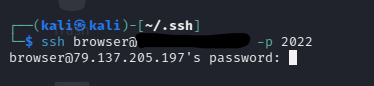
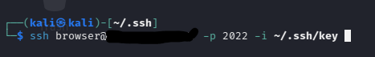
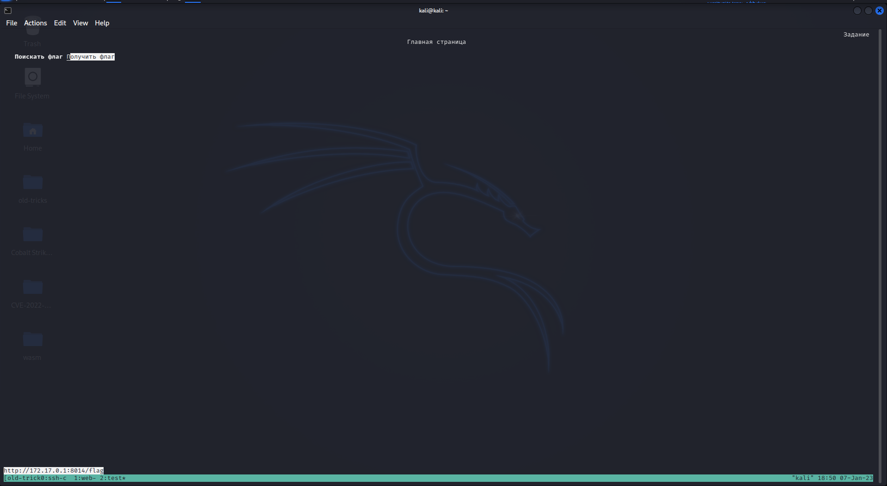
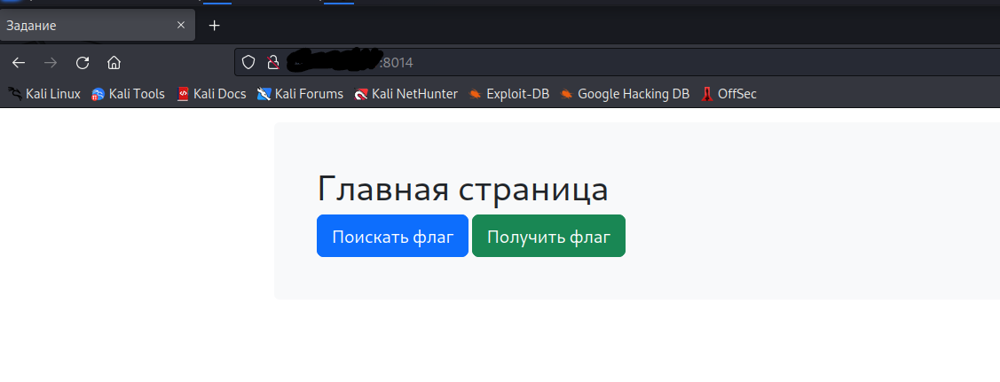
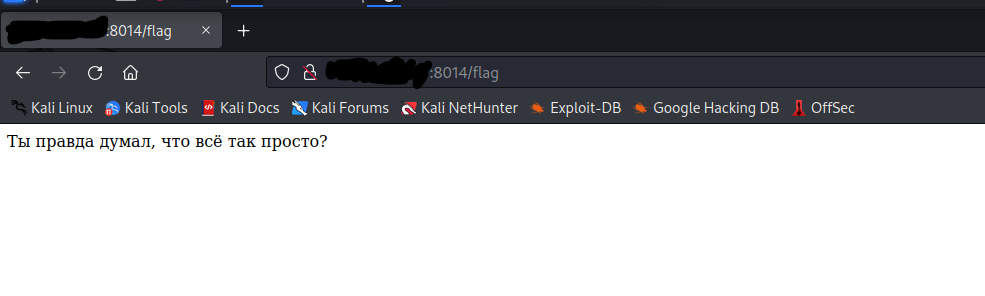
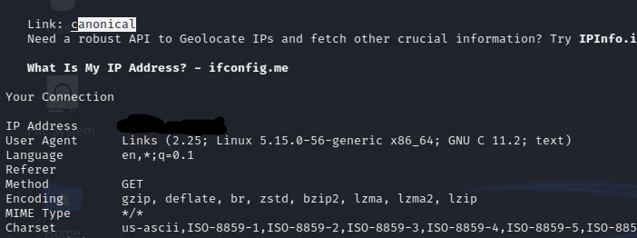
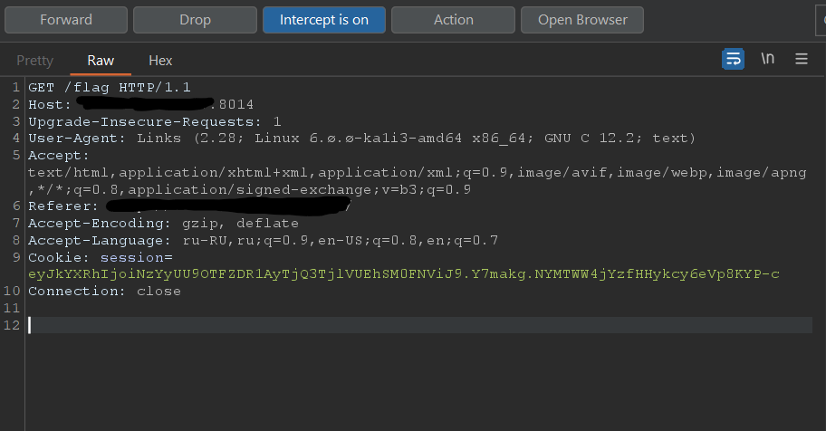
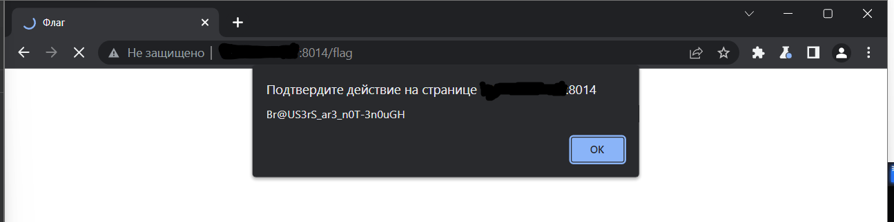

# mctf-old-tricks
## Инструкция по деплою
1. После клонирования репозитория вписать в скрипт [startup.sh](./app/startup.sh) домен или IP адрес сервера, чтобы до контентер ходил именно "в интернет" а не на адрес докера, иначе задание будет ~~нерешаемо~~ усложнится только.
2. В качестве описания использовать раздел ниже (заменить IP как в пункте 1), а также выдать участникам [файл](./key)   RSA ключа.
3. Заупстить docker-compose файлик. Веб страница на 8014 порту, ssh на 2022

## Описание 
Давным давно для выхода в интернет использовались консольные браузеры. Уверен даже с ним у вас не составит труда найти флаг. Не забудь приложенный файл! 
```
ssh browser@<ip> -p 2022
```
## Writeup
В описнии намеренно не указано что приложенный файл является RSA ключом. Без него на хост на хост зайти не поулчится 



Для подключения указываем также ключ вот такой командой.



После входа на машину у нас вызывается браузер на веб страничку с двумя опциями. 
- Поискать флаг
- Получить флаг 



Нажимаем кнопку получить флаг и видим только надпись "Вот твой флаг".


Вторая кнопка просто ведёт в гугл.

Попробуем зайти на домен с обычного броаузера 




Но флаг нам не отдают, при этом надпись меняется. Всё отличие между двумя браузерами - это User-Agent. Воспользуемся второй кнопкой и сходим с этого браузера в гугл чтобы узнать свой User-Agent (Например это можно сделать на [ifconfig.me](https://ifconfig.me)).


Возьмём User-Agent Links
```
Links (2.28; Linux 6.ø.ø-ka1i3-amd64 x86_64; GNU C 12.2; text)
```
И сделаем запрос с ним уже с полноценного браузера. Но на этот раз воспользуемся Burp Suite, чтобы на лету изменить отправляемый запрос. Это можно сделать и с обычного браузера.
Кнопкой intecept перехватываем запрос и меняем User-Agent. 



Потом нажимаем Forward. Флаг вылетает в Alert. Потому что Links не умеет их выдавать :)


## Flag 
```
Br@US3rS_ar3_n0T-3n0uGH
```
## TODO 
- ~~Idea~~
- ~~Ssh-links container~~
- ~~Webpage conatiner~~
- ~~Tests~~ 
